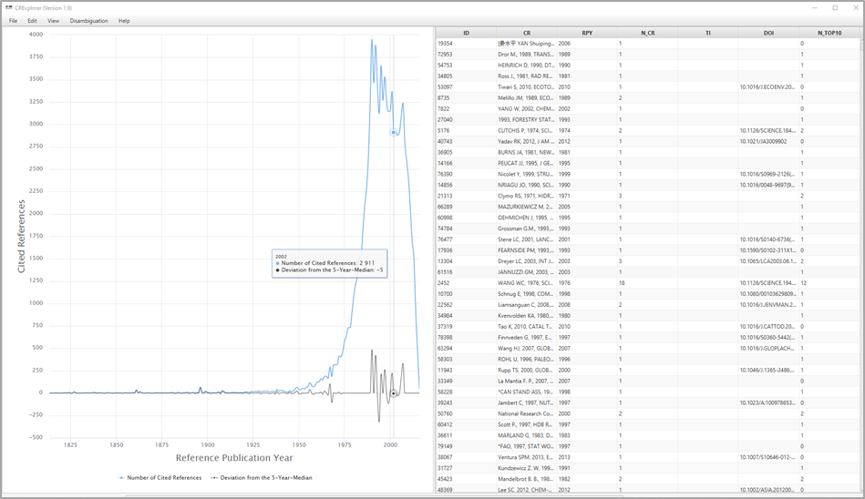

# User Interface

The screen of CRExplorer has two parts (see Figure 2): **data visualization** on the left side of the screen and **table view** on the right side. The **status bar** informs continuously about the number of (shown) CRs, the number of clusters, and the range of RPYs (cited publications) and PYs (citing publications).

 

/// caption
Figure 2. Screenshot of CRExplorer
///

## Data visualization

The visualization on the screen shows the number of CRs per RPY as **JFreeChart** or **HighCharts** (see Figure 2). One of these chart types can be chosen by the user (see section 4.1). Furthermore, the figure visualizes the deviation of the number of CRs in each year (*Y*) from the median for the number of CRs in the X previous, the current, and the X following years (*X* can be set under Settings, see section 4.1.6). The default is the deviation from the 5-Year-Median (*Y–2; Y–1 ; Y ; Y+1; Y+2*). This deviation from the *X*-year median provides a curve smoother than the one in terms of absolute numbers. If there is no CR in a specific RPY, the number of CRs of this RPY is set to zero for the calculation of the deviation from the median. Using the X-year median deviation curve, peaks in the data can be identified more easily than with the number of CRs curve, since each year is compared with its adjacent years.

Hovering the mouse cursor over a data point on one of the curves in the graph opens a small pop-up window showing the corresponding RPY, the sum of the CRs in this year (**Number of Cited References**), and the **Deviation from the *X*-Year Median**. Thus, the years of peaks in the curves and their impact can be identified easily.

By clicking on **Number of Cited References** or **Deviation from the *X*-Year Median**, respectively, the corresponding curve in the graph appears or disappears.

Using the mouse (and pressing simultaneously the control button), one can mark an area on the graph and restrict the visualized graph to the marked area. The user can recall the initial graph (and thus dissolve any changes) by right-clicking on the graph or by clicking on the button **Reset zoom**. This can also be accomplished via the **View** menu, see section 4.3.

## Table view

The table lists all CRs included in the analysis: The table initially shows the CRs as found in the WoS or another dataset. The data in the columns of the table can be sorted in ascending or descending order. It is also possible to sort by multiple columns: For example, if one wants to sort by column X and then by column Y, click firstly on column Y and then on column X.

To show all bibliographic details of a specific CR, select it in the table, and press the space bar.
Four areas of columns can be distinguished:

**1) Cited References**

* **ID**:  Every CR receives a unique identification number (column ID).
* **CR (Cited Reference)**:  Original CR from the imported dataset.
* **RPY (Reference Publication Year)**:  Publication year of the CR.
* **N_CR (Number of Cited References)**:  The number of times the CR has been cited.
* **AU (Author)**:  First author.
* **AU_A**: All author names if available in the input file, e.g., from Scopus.
* **AU_L (Last Name)**:  Last name of the first author.
* **AU_F (First Name Initial)**:  Initial of the first name of the first author.
* **J (Source)**:  Showing journal title, volume, issue, and first page in case of journal papers. Other information is shown in case of other document types.
* **J_N (Source Title)**:  Showing mostly the journal title or the abbreviated book title. Other information is shown in case of other document types.
* **J_S (Title Short)**:  The column contains the first letters of the words in Source title if there is more than one word. If there is only a single word, this word appears here.
* **VOL (Volume)**:  Volume of the CR.
* **PAG (Page)**:  First page of the CR.
* **DOI**:  DOI of the CR.

---

**2) Indicators**

* **PERC_YR (Percent in Year)**: The proportion of the number of times a CR has been cited among the number of all CRs in the same RPY.
* **PERC_ALL (Percent over all Years)**: The proportion of the number of times a CR has been cited among the number of CRs over all RPYs.
* **N_PYEARS (Number of Citing Years)**: Several CRs are cited in more than one publication with different publication years. N_PYEARS shows the number of different publication years in which the CR has been cited.
* **PERC_PYEARS (Percentage of Citing Years)**: The publication set which is analyzed by CRExplorer includes as a rule publications from different publication years. PERC_PYEARS shows the percentage of years (citing years), in which the CR was cited at least once. Thus, N_PYEARS is divided by the maximal number of citing years (i.e., all publication years with at least one mention of a CR from the specific RPY).
* **N_TOP50, N_TOP25, N_TOP10 (top 50%, 25%, 10% Cited Reference)**: These indicators can be used to identify those CRs which have been cited more frequently in the citing years than other CRs in the dataset ([Thor, et al., 2018](references.md#Thor2018)). In order to identify these CRs, thresholds are computed which identify the top 50%, top 25%, and top 10% in one citing year. In the first step of the computation, the citations in one citing year are sorted in ascending order. In the second step, the thresholds for the top 50%, 25%, and 10% are determined in a given year. In the third step, those CRs are identified which are above the three thresholds. In the fourth step, the numbers of citing years are counted in which the CRs are above the thresholds. These numbers yield N_TOP50, N_TOP25, and N_TOP10.
* **Sequence and Type**: In order to identify statistically the citation dynamic of CRs over time, we apply Configural Frequency Analysis (CFA, [Stemmler, 2014](references.md#Stemmler2014); [von Eye, 2002](references.md#vonEye2002)). CFA is a categorical statistical procedure to reveal configurations in multivariate cross-classifications (i.e., contingency tables). CRExplorer cross-classifies the CRs for a certain RPY and the publication year for the citing publications. In the case of systematic citation dynamics (e.g., if a publication belongs to the “sleeping beauty” type) citations in the cells deviate strongly from the expected values. Expected values are cell frequencies, which would occur if there is no relationship between or independency of the row (CRs) and the column variable (publication year). The approach of calculating expected values and deviations from these values is explained in detail in [Thor et al., 2018](references.md#Thor2018)).

To reveal specific sequences over time, CRs are considered with on average (“0”; z=1), above average (“+”; z>1), and below average (“-”; z<-1) citation impact in citing years. For example, the sequence ``[---+++000]`` means that the CR has been cited below average in the first three citing years, above average in the next three years, and on average in the last three citing years. Based on the sequences, types of CRs in terms of different citation dynamics or sequences of symbols (“+”, ”-“, “0”) are identified, which are labelled as follows (see Table 1): 

* “sleeping beauty” with low or no citations over a longer initial period and high citations later (type 1)
* “constant performer” with a constant and considerable amount of citations over time (type 2)
* “hot paper” with high citations directly after the publication and low citations later (type 3)
* “life cycle” with very different citation impact across the time period (type 4).

If CRs belong to more than one type, all types are indicated in the table.

Type of sequence | Definition
:-- | :-- 
Sleeping beauty (type 1) | Publication which has been cited below average in two of the first three citing years (“-“; z<-1) and above average (“+”; z>1) in the following citing years at least once
Constant performer (type 2) | Publication which has been cited in more than 80% of the citing years at least once. In more than 80% of the citing years it has been cited at least on the average level (“0”; -1<=z<=1) or (“+”; z>1)
Hot paper (type 3) | Publication which has been cited above average (“+”; z>1) in two of the first three citing years after publication
Life cycle (type 4) | Publication which has been cited in at least two of the first four years on the average level (“0”; -1<=z<=1) or lower (“-”; z<-1), in at least two years of the following years above average (“+”; z>1), and in the last three years on the average level (“0”; -1<=z<=1) or lower (“-”; z<-1)
/// caption
Table 1. Definition and default parameters for identifying different types of sequences
/// 

---

**3) Clustering (for the disambiguation of CR variants)**

* **ClusterID (CID2)**: Each cluster of the standardization procedure (see section 4.4) is uniquely identified by its ClusterID, i.e., all CRs of a cluster are marked with a corresponding ClusterID. Thus, the results of the similarity computation can be inspected using the column ClusterID.
* **ClusterSize (CID_S)**: The number of CRs in each cluster.

---

**4) Searching**

**Score from Search Process (SEARCH_SCORE)**: The column contains the value 1 for CRs including the string used by the user for searching and the value 0 otherwise (see section 4.3).

## Working with data visualization and table view together

Clicking on a data point in the graph (on the left side of the screen), the CRs data in the table (on the right side of the screen) is sorted by **Reference Publication Year** and **Number of Cited References / Percent in Year**, respectively (in descending order). Furthermore, the first CR with the highest percentage in the particular year is marked. Since the data is sorted by the **Number of Cited References / Percent in Year**, respectively, one can inspect the most important CRs which are responsible for a peak.

