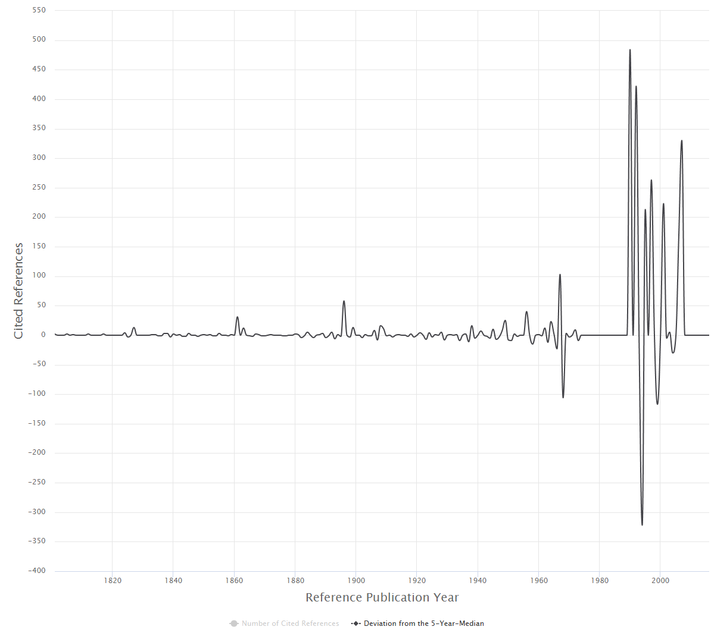

# Introduction

Which are the most important papers in the history of a field? On whose shoulders of giants does an author stand? Where to look for the intellectual roots of a research topic? These questions can be answered by conducting Reference Publication Year Spectroscopy (RPYS) with CRExplorer.

CRExplorer uses data from the Web of Science (Clarivate) or other sources as input. Publication sets have to be downloaded (or retrieved) including the references cited. The program focusses on the analysis of the cited references (CRs), in particular on the referenced publication years (RPYs). Over time, "citation classics" of a field become more pronounced in their RPYs. When aggregated CRs are plotted along a time axis (RPYs), one obtains a spectrogram with distinct peaks. CRExplorer visualizes this spectrogram, cleans the CRs (disambiguation), and uses a smoothing algorithm to suppress the noise. 

## Example Study: Greenhouse Effect

RPYS was developed by Werner Marx, who used it for the first time in the field of meteorology ([see his study](https://github.com/andreas-thor/CRExplorer/blob/main/documentation/papers/RMetS-Newsletter-2010.pdf)). For demonstration of the potential of the method, Figure 1 shows the citation classics concerning the discovery of the greenhouse effect, a basic component of climate change. 

To produce the figure, we downloaded 3,244 publications from the Web of Science containing the term *Greenhouse Effect* in the title or in the abstract or as a keyword. These papers contain 81,126 CRs to publications published over 379 RPYs. The graph produced by the CRExplorer shows three distinct peaks during the 19th century and a few others during the first half of the 20th century.

<figure style="display: table; float: left;">
    
    <figcaption style="display: table-caption; caption-side: bottom;"> 
        <i>Figure 1: Citation classics concerning the discovery of the <i>Greenhouse Effect</i> and appearing as peaks in the spectrogram provided by the CRExplorer.</i>
    </figcaption>
</figure>

 The first three pronounced peaks go back to the following cited publications:

* [Fourier's (1827)](https://www.academie-sciences.fr/pdf/dossiers/Fourier/Fourier_pdf/Mem1827_p569_604.pdf) paper, entitled *Mémoire sur les températures du globe terrestre et des espaces planétaires*, can be seen as the first decisive publication. Fourier found that the earth is warmer than expected. He attributed this to the phenomenon that the earth's atmosphere is transparent for solar radiation but not for the infrared radiation from the ground. Thus, he discovered the (natural) greenhouse effect.
* [Tyndall's (1861)](https://www.jstor.org/stable/108724?seq=1) study, entitled *On the absorption and radiation of heat by gases and vapours*, and on the physical connexion of radiation, absorption, and conduction, proved that the earth's atmosphere has a greenhouse effect. He concluded that water vapour is the principal gas controlling air temperature.
* [Arrhenius (1896](https://www.jstor.org/stable/40670917?seq=1), entitled *On the influence of carbonic acid in the air upon the temperature of the ground*) published the first study with a calculation of how changes in the levels of carbon dioxide in the atmosphere can alter the surface temperature through the greenhouse effect.

The subsequently following peaks in the spectrogram can be assigned to the works of [Chamberlin (1898)](https://www.jstor.org/stable/30055497), [Arrhenius (1908)](https://archive.org/details/worldsinmakingev00arrhrich), and Callendar ([1938](https://doi.org/10.1002/qj.49706427503), [1949]( https://doi.org/10.1002/j.1477-8696.1949.tb00952.x)). These are citation classics in the climate change literature. They deal with the possibility that climatic change results from changes in the concentration of atmospheric carbon dioxide—thereby supporting the calculation of [Arrhenius (1896](https://www.jstor.org/stable/40670917?seq=1). Whereas [Chamberlin (1898)](https://www.jstor.org/stable/30055497) and Callendar ([1938](https://doi.org/10.1002/qj.49706427503), [1949]( https://doi.org/10.1002/j.1477-8696.1949.tb00952.x)) have been written for scientists, [Arrhenius (1908)](https://archive.org/details/worldsinmakingev00arrhrich) book was directed at a general audience.

In sum, the discovery of the earth's greenhouse effect and the role of carbon dioxide and water vapor as greenhouse gases are no recent findings but date back to the beginning of the nineteenth century, see [Marx et al., 2016](http://link.springer.com/article/10.1007/s11192-016-2177-x) for more information.
