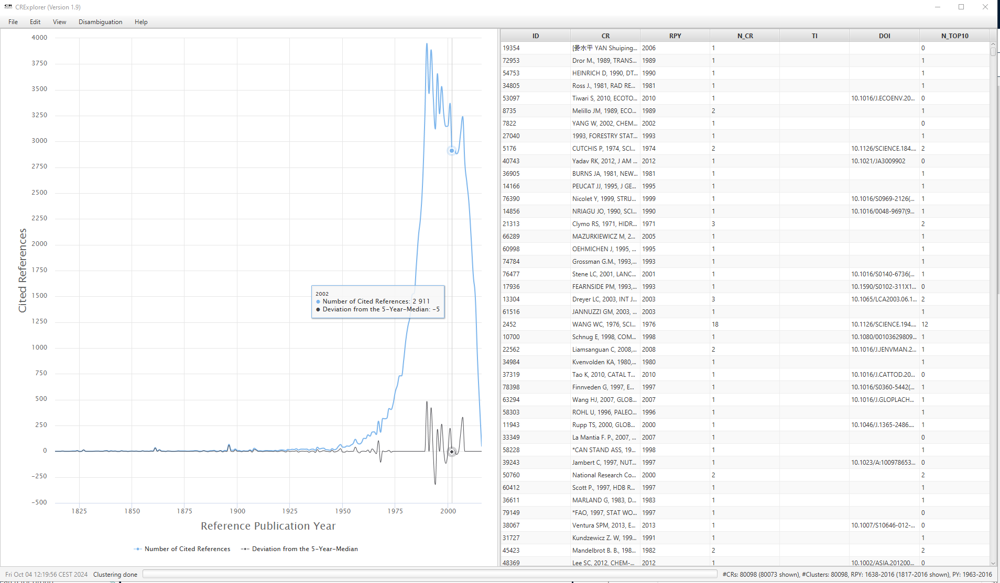

# Cited References Explorer (CRExplorer) Manual
***(for Version 2.0 from May 2026)***

**Software Development**

Andreas Thor 
HTWK Leipzig University of Applied Sciences 
Zschochersche Str. 69 
04299 Leipzig, Germany 
Email: andreas.thor@htwk-leipzig.de

Marc Indelen 
Sudetenstr. 31 
85586 Poing, Germany 
Email: marc@indelen.de

**Content Development**

Lutz Bornmann  Science Policy and Strategy Department 
Administrative Headquarters of the Max Planck Society 
Hofgartenstr. 8  80539 Munich, Germany  Email:
bornmann@gv.mpg.de 

Robin Haunschild  Max Planck Institute for Solid State Research 
Heisenbergstr. 1  70569 Stuttgart, Germany  Email:
R.Haunschild@fkf.mpg.de 

**With further support of (alphabetically ordered)**

Loet Leydesdorff  Amsterdam School of Communication Research
(ASCoR)  University of Amsterdam  P.O. Box 15793 
1001 NG Amsterdam, The Netherlands  Email: loet@leydesdorff.net

Werner Marx  Max Planck Institute for Solid State Research 
Information Service  Heisenbergstrasse 1  70506
Stuttgart, Germany  Email: w.marx@fkf.mpg.de

Rüdiger Mutz  Universität Zürich  Center for Higher Education and Science Studies  Plattenstrasse 54  8032
Zurich, Switzerland  Email: ruediger.mutz@uzh.ch 
