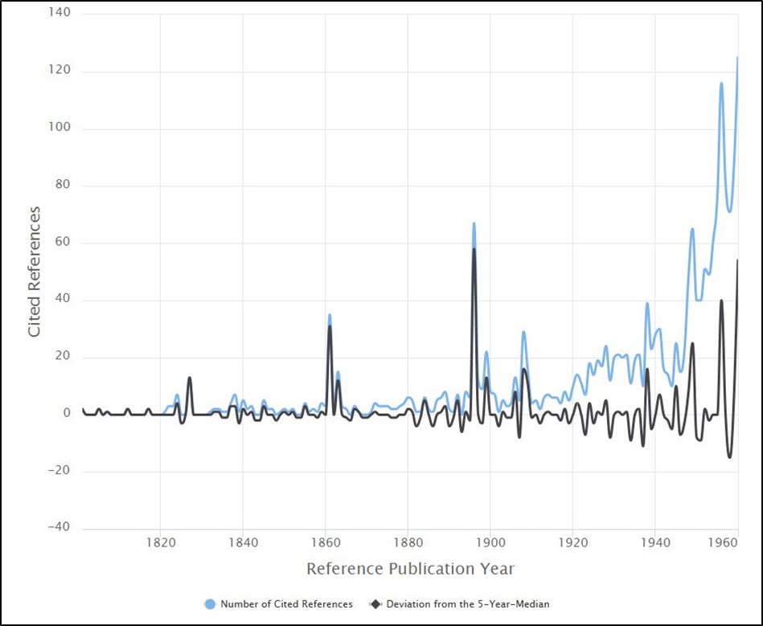

# Example – analyzing the discovery of the *greenhouse effect*

For demonstrating the potential of CRExplorer, Figure 1 shows the citation classics concerning the discovery of the *greenhouse effect*, a basic component of climate change. As dataset, we downloaded from the Web of Science 3,244 publications containing the term *greenhouse effect* in the title or in the abstract or as a keyword (date of searching: October 27th, 2016; analyses using more recent datasets yield similar results because we focus on citation classics). These papers contain 81,126 cited references (CRs) to publications which have appeared over 379 years. Figure 1 – as produced by CRExplorer – shows three distinct peaks during the 19th century and a few further peaks during the first half of the 20th century.

/// caption
Figure 1. Citation classics concerning the discovery of the *greenhouse effect* and appearing as peaks in the spectrogram provided by CRExplorer
///

The first three pronounced peaks go back to the following publications: [Fourier’s (1827)](https://www.academie-sciences.fr/pdf/dossiers/Fourier/Fourier_pdf/Mem1827_p569_604.pdf) paper, entitled "Mémoire sur les températures du globe terrestre et des espaces planétaires", can be seen as the first decisive publication. Fourier found that the earth is warmer than expected. He attributed this to the phenomenon that the earth’s atmosphere is transparent for solar radiation but not for the infrared radiation from the ground. Thus, he discovered the (natural) greenhouse effect. [Tyndall’s (1861)](https://www.jstor.org/stable/108724?seq=1) study, entitled “On the absorption and radiation of heat by gases and vapours, and on the physical connexion of radiation, absorption, and conduction”, proved that the earth’s atmosphere has a greenhouse effect. He concluded that water vapour is the principal gas controlling air temperature. [Arrhenius (1896)](https://www.jstor.org/stable/40670917?seq=1), entitled "On the influence of carbonic acid in the air upon the temperature of the ground", is the first study with a calculation of how changes in the levels of carbon dioxide in the atmosphere can alter the surface temperature through the greenhouse effect.

The subsequently following peaks can be assigned to the works of [Chamberlin (1899)](https://www.jstor.org/stable/30055497), [Arrhenius (1908)](https://archive.org/details/worldsinmakingev00arrhrich), Callendar ([1938](https://doi.org/10.1002/qj.49706427503), [1949](https://doi.org/10.1002/j.1477-8696.1949.tb00952.x)), and [Plass (1956)](https://doi.org/10.1111/j.2153-3490.1956.tb01206.x): [Chamberlin (1899)](https://www.jstor.org/stable/30055497) proposed the possibility that changes in climate could result from changes in the concentration of atmospheric carbon dioxide – thereby supporting the theory of [Arrhenius (1908)](https://archive.org/details/worldsinmakingev00arrhrich). The book by [Arrhenius (1908)](https://archive.org/details/worldsinmakingev00arrhrich) was directed at a general audience. [Callendar (1938)](https://doi.org/10.1002/qj.49706427503) developed the first complete theory of climatic change and stated in 1938 that carbon dioxide caused the warming trend of the preceding decades (see also [Callendar, 1949](https://doi.org/10.1002/j.1477-8696.1949.tb00952.x)). He presented evidence that both temperature and the CO~2~ level in the atmosphere had been rising over the past half-century. [Plass (1956)](https://doi.org/10.1111/j.2153-3490.1956.tb01206.x) calculated the transmission of radiation through the earth’s atmosphere and predicted that doubling the CO~2~ level would bring a 3-4 °C rise. He was the first to use a computer for climate modeling.

The small study about the discovery of the *greenhouse effect* demonstrates that the analysis of CRs using CRExplorer is able to identify early citation classics in the climate change literature. These classics deal with the possibility that climatic change results from changes in the concentration of atmospheric carbon dioxide. RPYS reveals that the discovery of the earth’s greenhouse effect and the role of carbon dioxide and water vapor as greenhouse gases are no recent findings, but dates back to the beginning of the nineteenth century.

